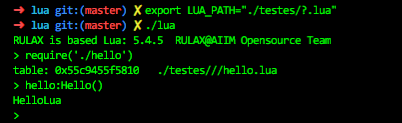

# 简介

本仓库是 **lua V5.4.5** 的官方 Fork 版本，主要用来给 I4DE 的高级网关增加脚本特性。后期可能会针对特殊硬件增加一些功能，但是完全兼容标准LUA V5.4.5，不会对原始LUA代码做任何修改。
## 特色
1. 支持中文变量名
```lua
你好 = "Hello"
print(你好)
```
2. 新扩展一个 `def` 关键字来实现和 `function` 同样的效果
```lua
def hello()
    print(你好)
end
hello()
```
其瓦全等同于:
```lua
function hello()
    print(你好)
end
hello()
```
1. 语法关键字全支持中文化
开发中....

| 原始保留字 | 对应中文 |
| ---------- | -------- |
| if         | 如果     |
| else       | 则       |

> 这里说明一下：首先这个中文关键字完全就是**把 LUA 的 Token 给 1:1翻译过来的**，除此之外没有任何别的更改或者扩展，例如把`if`翻译成：`若`。很多人对此有疑问，是不是闲的蛋疼，在这里我的看法是这个功能管别人用不用，你加上就行。

## 构建

下面主要是讲ubuntu下构建过程，Windows下建议使用MSYS2(不建议在Windows下开发lua)。

```sh
make clean
make
```

注意，如果出现下面这个问题：

```sh
fatal error: readline/readline.h: No such file or directory
  434 | #include <readline/readline.h>
      |          ^~~~~~~~~~~~~~~~~~~~~
compilation terminated.
make: *** [<builtin>: lua.o] Error 1
```

需要装一个库, 在ubuntu下命令如下:

```sh
sudo apt install libreadline-dev
```
## 环境
如图所示,本地调试可使用环境变量来指定lua文件加载路径：


## 社区

- 维护：wwhai

## 鸣谢

非常感谢LUA团队的优秀作品：[LUA](https://github.com/lua/lua)
